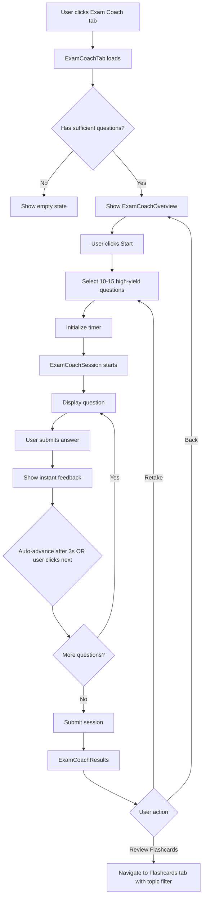

# Design Document

## Overview

The Exam Coach Mode is a specialized quiz experience designed for rapid knowledge assessment under time pressure. It leverages the existing quiz infrastructure while providing a streamlined, high-intensity interface optimized for students who need to quickly gauge their exam readiness.

The feature integrates seamlessly into the study pack detail page as a prominent tab, reuses existing quiz components and data structures, and provides a focused 10-15 question session with automatic timing and instant feedback.

## Architecture

### Component Hierarchy

```
StudyPackView
├── TabNavigation (modified to include Exam Coach tab)
└── ExamCoachTab (new)
    ├── ExamCoachOverview (new)
    │   ├── Orb (coach-whistle pose)
    │   ├── Session Stats Display
    │   └── Start Button
    ├── ExamCoachSession (new)
    │   ├── SessionHeader (new)
    │   │   ├── Progress Display
    │   │   ├── Timer Display (reused from quiz)
    │   │   └── Orb (timer/focused pose)
    │   ├── QuestionCard (reused from quiz)
    │   └── Auto-advance Logic
    └── ExamCoachResults (new)
        ├── Orb (results pose based on score)
        ├── Performance Summary
        ├── Weak Topics Display
        └── Action Buttons
```

### Data Flow



## Components and Interfaces

### 1. TabNavigation (Modified)

**File:** `src/components/study-packs/TabNavigation.tsx`

**Changes:**
- Add "Exam Coach" tab to the tabs array
- Position it second in the tab order (after Notes, before Flashcards)
- Use distinctive styling with accent color (orange/red gradient)
- Add Zap icon from lucide-react
- Add optional badge showing "QUICK" or lightning bolt emoji

**Interface:**
```typescript
// Add to TabType in StudyPackView.tsx
export type TabType = 'notes' | 'exam-coach' | 'flashcards' | 'quiz' | 'mindmap' | 'insights'

// Tab configuration
{
  id: 'exam-coach' as TabType,
  label: 'Exam Coach',
  icon: Zap,
  badge: '⚡', // Optional lightning bolt badge
  accentColor: 'from-orange-500 to-red-500' // Gradient for active state
}
```

### 2. ExamCoachTab (New)

**File:** `src/components/study-packs/tabs/ExamCoachTab.tsx`

**Purpose:** Main container component that manages the exam coach flow

**Props:**
```typescript
interface ExamCoachTabProps {
  packId: string
  userPlan?: string
}
```

**State:**
```typescript
{
  isSessionActive: boolean
  sessionData: ExamCoachSession | null
  isLoading: boolean
  error: string | null
}
```

**Responsibilities:**
- Fetch quiz data for the study pack
- Determine if sufficient questions exist (minimum 5)
- Manage session state (overview → active → results)
- Handle navigation between states

### 3. ExamCoachOverview (New)

**File:** `src/components/exam-coach/ExamCoachOverview.tsx`

**Purpose:** Landing screen that explains the feature and starts the session

**Props:**
```typescript
interface ExamCoachOverviewProps {
  questionCount: number
  estimatedMinutes: number
  onStart: () => void
}
```

**UI Elements:**
- Large Coach Orb (coach-whistle or exam-day pose)
- Motivational headline: "Test Your Exam Readiness"
- Session details card:
  - Number of questions (10-15)
  - Estimated time (~5-8 minutes)
  - Time per question (~30 seconds)
- Prominent "Start Exam Coach" button with energetic gradient
- Brief description of what to expect

**Styling:**
- Use orange/red accent colors to convey urgency and energy
- Larger, more prominent button than regular quiz
- Animated gradient background on the start button
- Pulsing animation on the Orb to draw attention

### 4. ExamCoachSession (New)

**File:** `src/components/exam-coach/ExamCoachSession.tsx`

**Purpose:** Active quiz session with timer and rapid question flow

**Props:**
```typescript
interface ExamCoachSessionProps {
  questions: QuizItem[]
  onComplete: (answers: Map<string, string>, duration: number) => void
  onExit: () => void
}
```

**State:**
```typescript
{
  currentIndex: number
  userAnswers: Map<string, string>
  answeredQuestions: Set<string>
  feedback: QuizFeedback | null
  timeRemaining: number
  startTime: number
  autoAdvanceTimer: NodeJS.Timeout | null
}
```

**Key Features:**

1. **Timer Logic:**
   - Total time = questionCount × 30 seconds
   - Display format: "MM:SS"
   - Color changes:
     - Green: > 25% remaining
     - Orange: 10-25% remaining
     - Red: < 10% remaining
   - Auto-submit when timer reaches 0

2. **Auto-advance:**
   - After user submits answer, show feedback for 3 seconds
   - Display countdown: "Next question in 3... 2... 1..."
   - User can click "Next" to skip countdown
   - Clear any existing auto-advance timer when user manually advances

3. **Question Display:**
   - Reuse existing QuestionCard component
   - Simplified layout (no mode selector, always rapid-fire)
   - Instant feedback on submission
   - Brief explanations (1-2 sentences max)

### 5. SessionHeader (New)

**File:** `src/components/exam-coach/SessionHeader.tsx`

**Purpose:** Displays progress and timer during active session

**Props:**
```typescript
interface SessionHeaderProps {
  currentQuestion: number
  totalQuestions: number
  timeRemaining: number
}
```

**UI Elements:**
- Left side: Progress (e.g., "Question 3 of 12")
- Center: Timer Orb with focused pose
- Right side: Timer display with color coding
- Progress bar below showing completion percentage

### 6. ExamCoachResults (New)

**File:** `src/components/exam-coach/ExamCoachResults.tsx`

**Purpose:** Display session results and provide next actions

**Props:**
```typescript
interface ExamCoachResultsProps {
  score: number
  correctCount: number
  totalQuestions: number
  duration: number
  weakTopics: string[]
  onRetake: () => void
  onReviewFlashcards: (topics: string[]) => void
  onExit: () => void
}
```

**UI Elements:**

1. **Results Orb:**
   - High score (≥80%): success-celebrating pose
   - Medium score (50-79%): encouraging pose
   - Low score (<50%): supportive pose (not sad, growth mindset)

2. **Score Display:**
   - Large percentage in center
   - "X out of Y correct" subtitle
   - Time taken display

3. **Performance Breakdown:**
   - Simple bar chart or list of topics
   - Highlight weak topics (< 70% accuracy)
   - Show question count per topic

4. **Action Buttons:**
   - Primary: "Review Weak Topics" (navigates to Flashcards tab with topic filter)
   - Secondary: "Retake Exam Coach"
   - Tertiary: "Back to Pack"

5. **Motivational Message:**
   - High score: "You're exam ready! 🎉"
   - Medium score: "Good progress! Review weak topics to improve."
   - Low score: "Keep studying! Focus on these areas:"

### 7. useExamCoachSession Hook (New)

**File:** `src/lib/hooks/useExamCoachSession.ts`

**Purpose:** Manage exam coach session state and logic

**Interface:**
```typescript
interface UseExamCoachSessionReturn {
  currentQuestion: QuizItem | null
  userAnswer: string | null
  isAnswered: boolean
  feedback: QuizFeedback | null
  progress: { current: number; total: number }
  timeRemaining: number
  isComplete: boolean
  results: ExamCoachResult | null
  isLoading: boolean
  error: string | null
  submitAnswer: (answer: string) => void
  nextQuestion: () => void
  exitSession: () => void
}
```

**Key Logic:**

1. **Question Selection:**
   ```typescript
   function selectHighYieldQuestions(allQuestions: QuizItem[], count: number): QuizItem[] {
     // Prioritize questions from key concepts in notes
     // Ensure topic diversity
     // Randomize order
     // Return 10-15 questions (or all if fewer available)
   }
   ```

2. **Timer Management:**
   ```typescript
   function initializeTimer(questionCount: number): number {
     return questionCount * 30 // 30 seconds per question
   }
   
   function getTimerColor(remaining: number, total: number): string {
     const percentage = (remaining / total) * 100
     if (percentage > 25) return 'text-green-400'
     if (percentage > 10) return 'text-orange-400'
     return 'text-red-400'
   }
   ```

3. **Auto-advance:**
   ```typescript
   function scheduleAutoAdvance(callback: () => void, delay: number = 3000) {
     return setTimeout(callback, delay)
   }
   ```

4. **Results Calculation:**
   ```typescript
   function calculateResults(
     answers: Map<string, string>,
     questions: QuizItem[]
   ): ExamCoachResult {
     // Calculate score
     // Identify weak topics (< 70% accuracy)
     // Calculate duration
     // Return structured result
   }
   ```

## Data Models

### ExamCoachSession

```typescript
interface ExamCoachSession {
  id: string
  studyPackId: string
  questions: QuizItem[]
  startTime: number
  totalTime: number // in seconds
  status: 'active' | 'completed' | 'abandoned'
}
```

### ExamCoachResult

```typescript
interface ExamCoachResult {
  sessionId: string
  score: number // percentage
  correctCount: number
  totalQuestions: number
  duration: number // in seconds
  weakTopics: Array<{
    topic: string
    accuracy: number
    questionCount: number
  }>
  answers: Array<{
    questionId: string
    userAnswer: string
    correctAnswer: string
    isCorrect: boolean
    topic: string
  }>
}
```

### API Response Types

```typescript
// GET /api/study-packs/:id/exam-coach/questions
interface ExamCoachQuestionsResponse {
  questions: QuizItem[]
  estimatedMinutes: number
}

// POST /api/study-packs/:id/exam-coach/submit
interface ExamCoachSubmitRequest {
  answers: Array<{
    questionId: string
    answer: string
  }>
  startTime: number
  duration: number
}

interface ExamCoachSubmitResponse {
  result: ExamCoachResult
}
```

## Error Handling

### Insufficient Questions

**Scenario:** Study pack has fewer than 5 quiz questions

**UI Response:**
- Display empty state with Supportive Orb
- Message: "Exam Coach needs at least 5 questions to run"
- Suggestion: "Try the regular Quiz mode instead"
- Button: "Go to Quiz" (navigates to quiz tab)

### Timer Expiration

**Scenario:** User doesn't complete all questions before timer runs out

**Behavior:**
- Auto-submit all answered questions
- Mark unanswered questions as incorrect
- Show results with note: "Time's up! Here's how you did on the questions you answered."

### Network Errors

**Scenario:** Failed to submit session results

**Behavior:**
- Store answers in localStorage as backup
- Show error message: "Failed to save results. Retrying..."
- Retry submission 3 times with exponential backoff
- If all retries fail, show: "Results saved locally. Please check your connection."

### Session Abandonment

**Scenario:** User navigates away during active session

**Behavior:**
- Show confirmation dialog: "Exit Exam Coach? Your progress will be lost."
- If confirmed, log "exam_coach_abandoned" event
- Clear session state

## Testing Strategy

### Unit Tests

1. **Question Selection Logic:**
   - Test high-yield question prioritization
   - Test topic diversity algorithm
   - Test randomization
   - Test edge cases (fewer than 10 questions available)

2. **Timer Logic:**
   - Test timer initialization
   - Test countdown behavior
   - Test color changes at thresholds
   - Test auto-submit on expiration

3. **Auto-advance Logic:**
   - Test 3-second delay
   - Test manual skip
   - Test timer cleanup

4. **Results Calculation:**
   - Test score calculation
   - Test weak topic identification
   - Test duration tracking

### Integration Tests

1. **Full Session Flow:**
   - Start session → answer questions → view results
   - Test with different question counts (5, 10, 15)
   - Test timer expiration scenario
   - Test retake functionality

2. **Navigation:**
   - Test tab switching
   - Test "Review Flashcards" navigation with topic filter
   - Test exit and return to overview

3. **Error Scenarios:**
   - Test insufficient questions
   - Test network failures
   - Test session abandonment

### E2E Tests

1. **Crammer Chris Persona:**
   - Upload material → generate pack → start exam coach → complete session → review weak topics
   - Verify entire flow completes in under 10 minutes

2. **Mobile Responsiveness:**
   - Test on mobile viewport (320px width)
   - Verify timer visibility
   - Verify button accessibility

3. **Accessibility:**
   - Test keyboard navigation
   - Test screen reader announcements
   - Test reduced motion preferences

## Performance Considerations

### Question Selection Optimization

- Pre-calculate high-yield questions during pack generation
- Store priority scores in quiz_items.meta_json
- Cache selected questions for session duration

### Timer Performance

- Use requestAnimationFrame for smooth countdown
- Debounce timer updates to reduce re-renders
- Memoize timer color calculations

### Auto-advance Optimization

- Clear timers on component unmount
- Use useCallback for advance functions
- Prevent multiple simultaneous auto-advance timers

## Accessibility

### Keyboard Navigation

- Tab order: Start button → Question options → Submit → Next
- Escape key: Exit session (with confirmation)
- Enter key: Submit answer / advance to next question

### Screen Reader Support

- Announce timer warnings at 25% and 10% remaining
- Announce question number changes
- Announce correct/incorrect feedback
- Provide descriptive labels for all interactive elements

### Visual Accessibility

- Maintain 4.5:1 contrast ratio for all text
- Use color + icon for timer warnings (not color alone)
- Provide text alternatives for Orb poses
- Support reduced motion preferences (disable auto-advance animations)

### Mobile Accessibility

- Minimum touch target size: 44×44px
- Adequate spacing between interactive elements
- Responsive timer display
- Scrollable question content

## Analytics Events

### Event Tracking

```typescript
// Session start
{
  event: 'exam_coach_started',
  props: {
    study_pack_id: string,
    question_count: number,
    estimated_duration: number
  }
}

// Session complete
{
  event: 'exam_coach_completed',
  props: {
    study_pack_id: string,
    score: number,
    duration_seconds: number,
    weak_topics: string[],
    questions_answered: number,
    timer_expired: boolean
  }
}

// Session abandoned
{
  event: 'exam_coach_abandoned',
  props: {
    study_pack_id: string,
    questions_answered: number,
    time_remaining: number
  }
}

// Review flashcards clicked
{
  event: 'exam_coach_review_clicked',
  props: {
    study_pack_id: string,
    weak_topics: string[],
    score: number
  }
}

// Retake clicked
{
  event: 'exam_coach_retake_clicked',
  props: {
    study_pack_id: string,
    previous_score: number
  }
}
```

## Design Specifications

### Color Palette

- **Primary Accent:** Orange to Red gradient (`from-orange-500 to-red-500`)
- **Timer Colors:**
  - Safe: `text-green-400`
  - Warning: `text-orange-400`
  - Urgent: `text-red-400`
- **Background:** Consistent with app dark mode theme
- **Borders:** `border-orange-500/30` for exam coach elements

### Typography

- **Headline:** 3xl font-bold (Overview title)
- **Score Display:** 6xl font-bold (Results score)
- **Timer:** 2xl font-bold
- **Progress:** lg text-gray-400
- **Body Text:** base text-gray-300

### Spacing

- **Card Padding:** p-8
- **Button Padding:** px-8 py-4
- **Section Gaps:** space-y-6
- **Grid Gaps:** gap-4

### Animations

- **Fade In:** animate-in fade-in duration-500
- **Scale on Hover:** hover:scale-105
- **Button Pulse:** Subtle pulse on Start button
- **Timer Warning:** Gentle shake animation at 10% remaining
- **Auto-advance Countdown:** Fade in/out numbers

### Orb Poses

- **Overview:** coach-whistle or exam-day
- **Active Session:** timer or focused
- **High Score:** success-celebrating
- **Medium Score:** encouraging
- **Low Score:** supportive
- **Empty State:** supportive
- **Error:** error-confused

## Migration and Rollout

### Phase 1: Core Implementation
- Implement ExamCoachTab component
- Add tab to navigation
- Implement question selection logic
- Implement basic session flow

### Phase 2: Polish and Testing
- Add timer functionality
- Implement auto-advance
- Add results screen
- Comprehensive testing

### Phase 3: Analytics and Optimization
- Add event tracking
- Monitor usage patterns
- Optimize question selection
- A/B test timer duration

### Phase 4: Enhancements (Future)
- Custom timer settings
- Difficulty-based question selection
- Historical performance tracking
- Leaderboards (optional)
